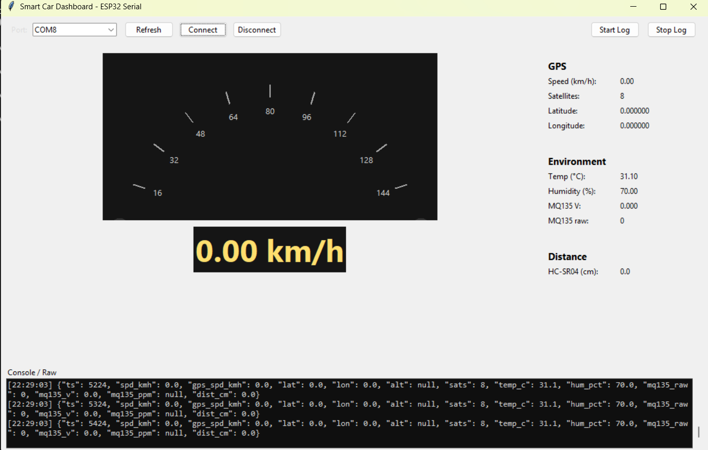

## 🚗 ESP32 Smart Car Dashboard

A IoT dashboard that monitors **vehicle speed, GPS position, environmental data, and gas levels**, built with **ESP32** and a **Python Tkinter GUI** interface.


*(Example GUI built with Tkinter — showing live data updates from ESP32)*

---

### 📖 Overview

This project connects multiple sensors to an **ESP32** to create a small-scale smart car monitoring system.
Data from sensors (DHT11, GPS, Hall speed sensor, MQ135, and HC-SR04) are read in real time and sent via serial (JSON format) to a Python-based dashboard.

**Main features:**

* 🌡️ Measure **temperature & humidity** (DHT11)
* 🛰️ Get **GPS location**, **speed**, and **satellite count** (TinyGPS++)
* 🌀 Compute **wheel speed** from Hall sensor (FC-33)
* 🧪 Detect **gas concentration** (MQ135)
* 📏 Measure **distance** using ultrasonic (HC-SR04)
* 💡 Control **turn signals** (Left/Right indicators)
* 🔊 Buzzer warning when object ≤ 10 cm
* 💻 **Tkinter GUI** displays data in real time with speed gauge & environment info

---

### 🧰 Hardware Components

| Component                          | Description                     |
| ---------------------------------- | ------------------------------- |
| **ESP32**                          | Main microcontroller            |
| **DHT11**                          | Temperature and humidity sensor |
| **FC-33 (Hall sensor)**            | Wheel speed measurement         |
| **MQ135**                          | Air quality / gas sensor        |
| **GPS Module (NEO-6M or similar)** | Latitude, longitude, and speed  |
| **HC-SR04**                        | Ultrasonic distance measurement |
| **Buzzer**                         | Alert when object is near       |
| **LEDs**                           | Left and right turn signals     |

---

### ⚙️ Pin Configuration

| Sensor / Module      | ESP32 Pin |
| -------------------- | --------- |
| DHT11                | 4         |
| MQ135 (Analog)       | 34        |
| FC-33 (Hall DO)      | 27        |
| HC-SR04 TRIG / ECHO  | 5 / 18    |
| GPS RX / TX          | 16 / 17   |
| Left / Right Signals | 19 / 21   |
| Buzzer               | 25        |

---

### 🧠 Software Features

* **FreeRTOS tasks** for parallel sensor reading:

  * `Task_ReadDHT()` – Read DHT11 every 2 s
  * `Task_ReadMQ135()` – Read gas sensor every 1 s
  * `Task_ReadGPS()` – Parse GPS data continuously
  * `Task_ReadSR04()` – Measure distance & trigger buzzer
  * `Task_SendToPC()` – Send all sensor data to PC (JSON via Serial)
* **Speed Calculation**:

  * Uses both **gate time** and **period measurement** for stable readings.
* **Turn Signal Control**:

  * Toggle left/right via serial commands: `TURN_LEFT` or `TURN_RIGHT`

---

### 🧩 Data Format (JSON Output)

Example serial output:

```json
{
  "ts": 110535,
  "spd_kmh": 0.0,
  "gps_spd_kmh": 0.0,
  "lat": 11.036155,
  "lon": 106.241208,
  "alt": null,
  "sats": 7,
  "temp_c": 29.9,
  "hum_pct": 75.0,
  "mq135_raw": 70,
  "mq135_v": 0.056,
  "mq135_ppm": null,
  "dist_cm": 0.0
}
```

---

### 🖥️ Python Dashboard (Tkinter)

The GUI receives JSON data from the serial port, parses it, and updates:

* Real-time **speed gauge**
* **Temperature**, **humidity**, and **gas voltage**
* **GPS coordinates**
* **Distance** (HC-SR04)
* Logging feature (`Start Log` / `Stop Log`)
* Turn signal control buttons (`Xi nhan Trái`, `Xi nhan Phải`)

> 🐍 *The Python script uses `pyserial`, `tkinter`, and `matplotlib` for visualization.*

---

### ⚡ How to Run

1. **Upload** the Arduino code to your ESP32 using the Arduino IDE.
2. **Connect** the ESP32 to your PC via USB.
3. Open the **Python Tkinter dashboard**:

   ```bash
   python dashboard.py
   ```
4. Select the correct **COM port** and click **Connect**.
5. Observe live sensor readings and speed updates!

---

### 📦 Dependencies

#### Arduino Libraries:

* `DHT sensor library`
* `TinyGPS++`
* `ArduinoJson` *(optional if using advanced parsing)*

#### Python Modules:

```bash
pip install pyserial matplotlib tkinter
```

---

